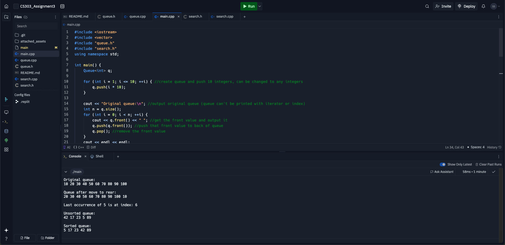

# CS303_Assignment3
For this assignment done in replit, it is much easier to run.

To make changes, update the code to the desired integers you would like to run the functions with. After, enter this command:
g++ -o main main.cpp search.cpp -std=c++11
And run with this command:
./main

However, due to the project being on replit, you can simply click the run button at the top. Screenshots are pasted below.
Thanks!

Sam Safly
CS303-0002-13031

